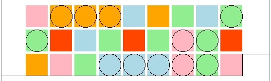
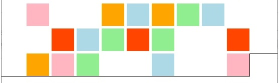
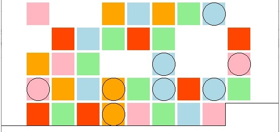
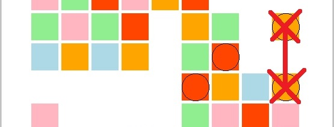
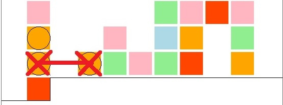
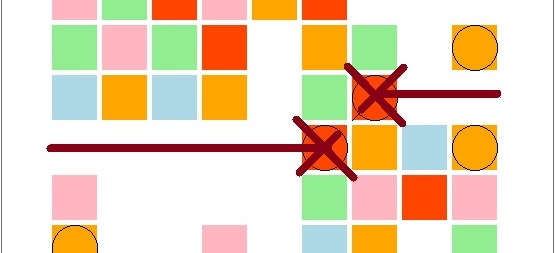

# Суть игры.

1. В начале игры поле заполнено цветными квадратами.
Кружками обозначены тайлы, которые можно *сократить*.

2. Сокращенные тайлы исчезают с игрового поля.
После того, как не осталось ни одного тайла для сокращения, следует нажать кнопку "ADD"

3. После нажатия "ADD" на игровое поле добавляется дополнительные тайлы в том же количестве и с теми же цветами (если читать слева направо сверху вниз).
Таким образом количество тайлов удваивается.
Кружками обозначены тайлы, которые снова можно сократить.

# Условие победы
Игра продолжается пока на поле не останется ни одного тайла.

# Правило сокращения тайлов

1. Можно сокращать тайлы одинаковых цветов, находящихся в одном столбце.

2. Можно сокращать тайлы одинаковых цветов, находящихся в одной строке.

3. Можно сокращать тайлы одинаковых цветов, следующих друг за другом, если читать слева направо сверху вниз.

# Результаты игры и подсчет очков

Pair - общее количество сокращенных пар.

Score - количество очков. 

После сокращения каждой пары добавляется количество очков равное количеству имеющхся цветов на игровом поле.
В начале игры количество цветов равно 5. Поэтому за каждую сокращенную пару дается 5 очков. 
По мере прохождения некоторые цвета будут выходить из игры. 
Соответственно, количество очков, которые даются за одну пару, будет постепенно сокращаться.

